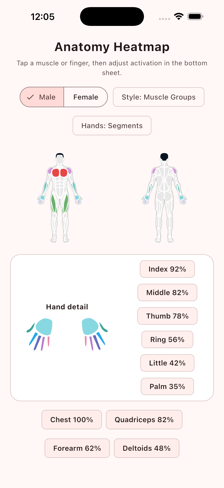

# anatomy_heatmap

## Credits

`anatomy_heatmap` is the Flutter version / port of
[`react-native-body-highlighter`](https://github.com/HichamELBSI/react-native-body-highlighter).
It converts the upstream body SVG path data and outline data into Dart and adds
Flutter `CustomPainter` rendering, deterministic muscle-to-region mapping, and
tree-shaped hand regions (`hands -> palm/thumb/index/middle/ring/little`).

Upstream credit:

- **Project:** `react-native-body-highlighter`
- **Author / copyright:** Copyright (c) 2022 ELABBASSI Hicham
- **Repository:** <https://github.com/HichamELBSI/react-native-body-highlighter>
- **Notice file:** [`THIRD_PARTY_NOTICES.md`](THIRD_PARTY_NOTICES.md)

---

`anatomy_heatmap` is a small Flutter package for rendering body-part SVG
heatmaps. It ports the useful SVG path taxonomy from
[`react-native-body-highlighter`](https://github.com/HichamELBSI/react-native-body-highlighter)
and adds deterministic Frez-style muscle-to-body-part mapping semantics.

## Preview

Example app running on an iPhone 17 Pro Max simulator:

<p align="center">
  
</p>

## Features

- Male and female body maps.
- Front and back body views.
- Body-part slug highlighting with left/right/both/common side semantics.
- Seed-color opacity heatmap rendering for primary, secondary, or aggregate load.
- Preset color styles, including a region-specific `muscleGroups` palette.
- Explicit muscle-name-to-SVG-slug adapter; no fuzzy runtime inference.
- Tree-shaped hand heatmaps: `hands` can be highlighted as a parent or split
  into palm, thumb, index, middle, ring, and little-finger child regions.
- Configurable full-body hand detail level: aggregate to parent `hands` or
  render palm/finger child segments.
- Example app follows the device/system light or dark theme and can switch
  preset styles live.

## Usage

The bundled `example/` app includes a male/female toggle, preset style selector,
and tap-to-edit activation sliders so you can inspect how each muscle slug
responds.

```dart
import 'package:anatomy_heatmap/anatomy_heatmap.dart';

final adapter = MuscleToBodyPartAdapter();
final mapped = adapter.mapToHighlights(
  primaryMuscles: const ['Pectoralis', 'Triceps'],
  secondaryMuscles: const ['Rotator Cuff', 'Forearm'],
);

AnatomyHeatmap(
  gender: BodyGender.male,
  views: const [BodyView.front, BodyView.back],
  highlights: mapped.highlights,
  colorScheme: BodyHeatmapColorScheme.muscleGroups,
  handDetailLevel: HandDetailLevel.segments,
  onPartTap: (tap) {
    // tap.slug, tap.side, tap.view, tap.highlight?.metric
  },
);
```

In layouts without a bounded height, provide `height`:

```dart
const AnatomyHeatmap(
  height: 360,
  highlights: [
    BodyHighlightData(slug: BodyPartSlug.chest, intensity: 1),
    BodyHighlightData(slug: BodyPartSlug.upperBack, intensity: 0.45),
  ],
);
```

## Heatmap semantics

The default `BodyHeatmapColorScheme.redLoad` uses:

- inactive anatomical regions: light gray;
- primary muscles: warm red/coral at higher opacity;
- secondary muscles: the same hue at lower opacity;
- aggregate workout heatmaps: intensity `0.0..1.0` controls opacity, where higher
  intensity means more volume/load exposure.

Intensity is clamped safely. Values below `0` render inactive and values above
`1` render at maximum heat opacity.

`redLoad` is a seed-based single-hue preset. The default seed is the existing
coral red, but you can choose another hue and keep the same opacity model:

```dart
final scheme = BodyHeatmapColorScheme.fromPreset(
  BodyHeatmapColorPreset.redLoad,
  brightness: Theme.of(context).brightness,
  redLoadSeedColor: const Color(0xFF2563EB),
);
```

For a more anatomical/categorical look, use
`BodyHeatmapColorScheme.muscleGroups`. It keeps the same intensity-based opacity
model but assigns different base hues to major regions and hand child segments.
Caller-provided `BodyHighlightData.color` still overrides any preset color.
For system-aware examples, select a preset style and pass the current brightness:

```dart
final scheme = BodyHeatmapColorScheme.fromPreset(
  BodyHeatmapColorPreset.muscleGroups,
  brightness: Theme.of(context).brightness,
);
```

Preset colors are only defaults. Inject product-specific color settings with
`withOverrides`:

```dart
final scheme = BodyHeatmapColorScheme.fromPreset(
  BodyHeatmapColorPreset.muscleGroups,
  brightness: Theme.of(context).brightness,
).withOverrides(
  bodyPartHeatColors: {
    BodyPartSlug.chest: const Color(0xFFDC2626),
    BodyPartSlug.quadriceps: const Color(0xFF16A34A),
  },
  handPartHeatColors: {
    HandPartSlug.indexFinger: const Color(0xFF0284C7),
  },
);
```

Use `copyWith` instead when you want to replace a color map entirely.

## Hand detail levels

The full `AnatomyHeatmap` can treat hands at two levels:

- `HandDetailLevel.handsOnly`: renders each hand as a parent `hands` region.
  A parent `hands` highlight controls the whole hand; if no parent highlight is
  supplied, existing palm/finger highlights are aggregated into that region.
- `HandDetailLevel.segments`: renders palm, thumb, index, middle, ring, and
  little-finger child paths in the full body map. Exact child highlights take
  precedence over a parent `hands` fallback so finger opacity remains adjustable.

```dart
AnatomyHeatmap(
  highlights: mapped.highlights,
  handDetailLevel: HandDetailLevel.handsOnly,
);
```

The adapter can also emit either level:

```dart
final mapped = MuscleToBodyPartAdapter().mapToHighlights(
  primaryMuscles: targetMuscles,
  secondaryMuscles: synergistMuscles,
  handDetailLevel: HandDetailLevel.handsOnly,
);
```

Use `HandPartsHeatmap` when you want a dedicated zoomed-in palm/finger panel
regardless of the full-body hand level.

## Deterministic muscle adapter

`MuscleToBodyPartAdapter` maps exercise metadata such as `target_muscles` and
`synergist_muscles` into SVG body-part slugs using an explicit alias table.
One input can map to multiple slugs: for example `Finger Flexors` maps to both
`forearm` and `hands`. If the same slug appears in both primary and secondary
sets, primary wins. Unknown labels are returned in `unmapped` so product tests
can detect missing taxonomy coverage. Back labels are split so `Latissimus`,
`Latissimus Dorsi`, and `Lats` map to `lats`, while `Rhomboids` remains
`upperBack` and `Erector Spinae` remains `lowerBack`. Specific hand labels such
as `Thumb`,
`Index Finger`, `Middle Finger`, `Ring Finger`, `Pinky`, and `Palm` are emitted
as `BodyPartSlug.hands` highlights with `handPart` populated, so the full
`AnatomyHeatmap` can color exact child regions instead of collapsing them to the
whole hand. Pass `handDetailLevel: HandDetailLevel.handsOnly` to
`mapToHighlights` when your product wants to keep the data at parent-hand level.

## Segmented hand/finger heatmaps

The upstream body SVG contains six `hands` fragments per side. `AnatomyHeatmap`
classifies those fragments by geometry, so `BodyPartSlug.hands` can behave like
a parent node with child palm/finger heatmap regions:

```dart
AnatomyHeatmap(
  highlights: const [
    // Parent hand highlight: applies to every palm/finger child unless a
    // stronger child highlight is provided.
    BodyHighlightData(slug: BodyPartSlug.hands, intensity: 0.25),
    BodyHighlightData(
      slug: BodyPartSlug.hands,
      handPart: HandPartSlug.indexFinger,
      intensity: 1,
    ),
    BodyHighlightData(
      slug: BodyPartSlug.hands,
      handPart: HandPartSlug.middleFinger,
      intensity: 0.7,
    ),
  ],
  onPartTap: (tap) {
    // tap.slug == BodyPartSlug.hands
    // tap.handPart is palm/thumb/indexFinger/middleFinger/ringFinger/littleFinger.
  },
);
```

For a zoomed hand-only UI, use the same taxonomy with `HandPartsHeatmap`:

```dart
HandPartsHeatmap(
  views: const [BodyView.front],
  sides: const [BodySide.left, BodySide.right],
  highlights: const [
    HandHighlightData(slug: HandPartSlug.palm, intensity: 0.3),
    HandHighlightData(slug: HandPartSlug.thumb, intensity: 0.8),
    HandHighlightData(slug: HandPartSlug.indexFinger, intensity: 1),
    HandHighlightData(slug: HandPartSlug.middleFinger, intensity: 0.7),
    HandHighlightData(slug: HandPartSlug.ringFinger, intensity: 0.5),
    HandHighlightData(slug: HandPartSlug.littleFinger, intensity: 0.35),
  ],
  onPartTap: (tap) {
    // tap.slug is palm/thumb/indexFinger/middleFinger/ringFinger/littleFinger.
  },
);
```

Future climbing patterns to model explicitly include `4F`, `3F front/back`,
`2F front/middle/back`, `mono`, `pinch/thumb opposition`, and custom pockets.

## License

`anatomy_heatmap` is MIT licensed. See [`LICENSE`](LICENSE) for the full package
license text.

This repository also includes Dart-converted SVG path data and body outline data
derived from `react-native-body-highlighter`, which is MIT licensed. The
upstream copyright and MIT notice are preserved in
[`THIRD_PARTY_NOTICES.md`](THIRD_PARTY_NOTICES.md). Keep that notice when
redistributing this package or derived path data.

Summary:

- Package source code in this repository: MIT, copyright (c) 2026
  `anatomy_heatmap` contributors.
- Converted anatomy SVG path data and outline data: derived from
  `react-native-body-highlighter`, MIT, copyright (c) 2022 ELABBASSI Hicham.
- Runtime dependency `path_drawing` is pulled from pub.dev and remains under its
  own package license; it is not vendored into this repository.

Files:

- [`LICENSE`](LICENSE): MIT license for this package.
- [`THIRD_PARTY_NOTICES.md`](THIRD_PARTY_NOTICES.md): upstream MIT notice for
  `react-native-body-highlighter` SVG path and outline data.
